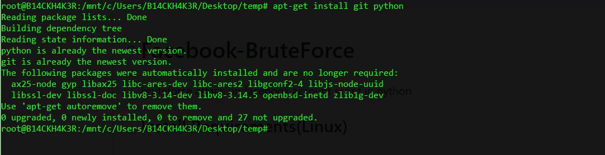

# Facebook-BruteForce
```
Bruteforce attack, For educational purpose only
```

## Install Requirements (on Linux)
```
sudo apt install -y git python3 python3-pip python python-pip
```

## Run commands one by one
```
git clone https://github.com/Xcod3bughunt3r/fbbruteforce.git 
cd fbbruteforce && sudo chmod 777 *.py 
python3 -m pip install requests bs4 
python3 -m pip install mechanize 
python3 fb.py 
```

## Screens



## Protection Against Attacker
* Use Strong Password(which contains standard password chars + longest as possible)
* Use 2F Authentication.
* Make location based login(+browser based).

~~~
Happy Hacking Day !
~~~
